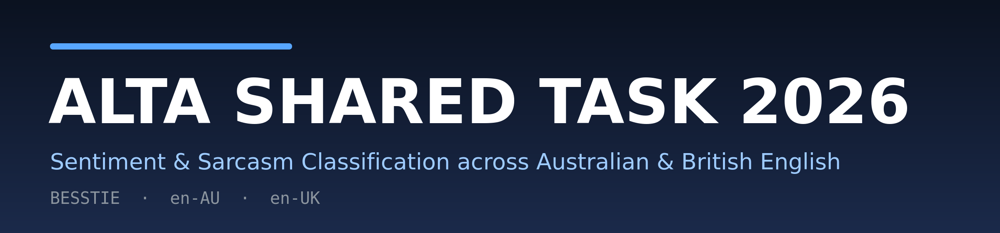
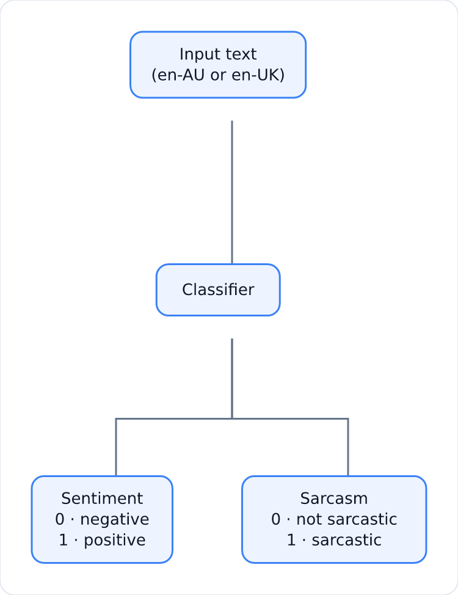
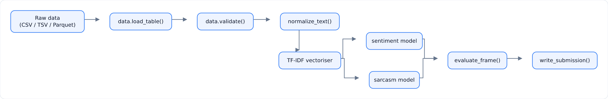
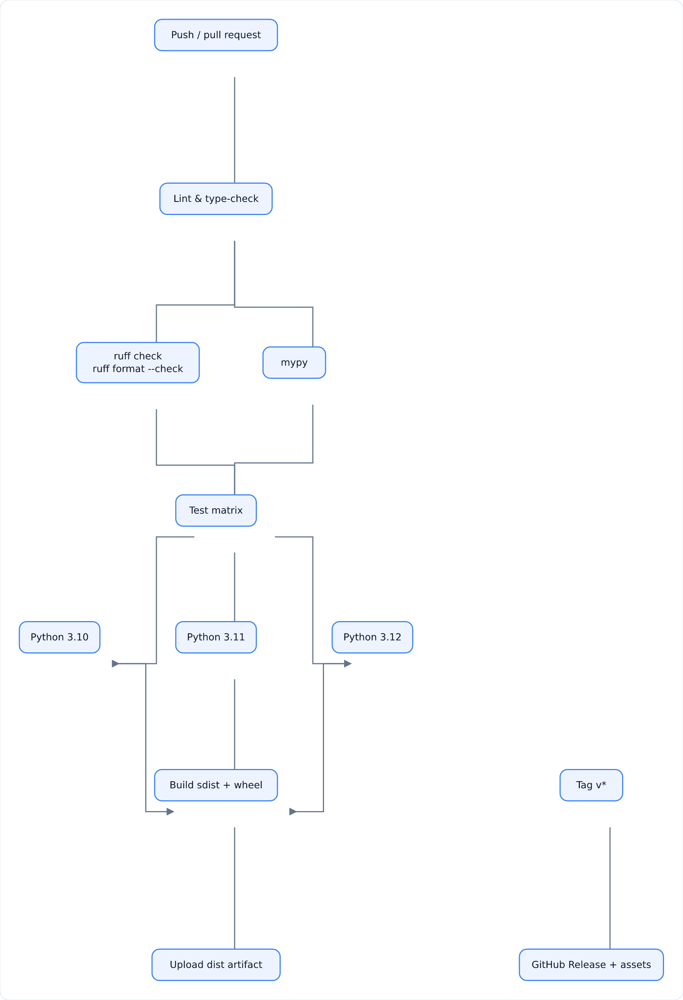

<p align="center">
  
</p>

<p align="center">
  <a href="https://github.com/rifat-binreza/skills-introduction-to-git/actions/workflows/ci.yml"></a>
  <a href="https://github.com/rifat-binreza/skills-introduction-to-git/blob/main/LICENSE"></a>
  <a href="https://www.python.org/downloads/"></a>
  <a href="https://github.com/astral-sh/ruff"></a>
</p>

_Baseline and tooling for the **ALTA 2026 Shared Task**: joint **sentiment** and
**sarcasm** classification across **Australian (en-AU)** and **British (en-UK)**
English, using the [BESSTIE](https://huggingface.co/datasets/unswnlporg/BESSTIE)
benchmark._

## Table of contents

- [The task](#the-task)
  - [At a glance](#at-a-glance)
  - [Example annotations](#example-annotations)
  - [Key dates](#key-dates)
- [Quick start](#quick-start)
- [Usage](#usage)
- [Architecture](#architecture)
- [Evaluation](#evaluation)
- [Repository structure](#repository-structure)
- [CI/CD](#cicd)
- [Development](#development)
- [Resources](#resources)
- [Documentation](#documentation)
- [Citation](#citation)
- [License](#license)

---

## The task

The seventeenth ALTA programming competition asks participants to build a system
that, for a given piece of **Australian** or **British** English text, predicts
two binary labels:

| Task | Label `0` | Label `1` |
| --- | --- | --- |
| **Sentiment** | negative | positive |
| **Sarcasm** | not sarcastic | sarcastic |

Systems are evaluated on the **en-AU** and **en-UK** subsets of
[BESSTIE](https://aclanthology.org/2025.findings-acl.441/) (Srirag et al.,
2025) and are expected to remain **robust across both English varieties**.

### At a glance

<p align="center">
  
</p>

### Example annotations

Real examples from BESSTIE, covering the four label combinations:

| Variety | Text | Sentiment | Sarcasm |
| --- | --- | --- | --- |
| en-AU | "This was one of the best dishes I've EVER had! … perfectly cooked." | 1 | 0 |
| en-AU | "Ordered the 'avocado goodness' burger and this is how much avo was on it…" | 0 | 1 |
| en-AU | "Staff don't seem to care anymore. The manager… doesn't have service skills at all." | 0 | 0 |
| en-UK | "Traditional friendly pub. Excellent beer" | 1 | 0 |
| en-UK | "What a brave potatriot" | 0 | 1 |

### The BESSTIE dataset

| Variety | Rows (public snapshot) | Domains |
| --- | --- | --- |
| en-AU | 3.08k | GOOGLE, REDDIT |
| en-IN | 3.79k | GOOGLE, REDDIT |
| en-UK | 3.21k | GOOGLE, REDDIT |

The public [Hugging Face snapshot](https://huggingface.co/datasets/unswnlporg/BESSTIE)
provides one config per variety (`en_AU`, `en_IN`, `en_UK`) with columns
`source`, `variety`, `text`, `sentiment` and `sarcasm`, split into `train` and
`validation`. The 2026 shared task distributes its own official splits
(train/dev/test) after [registration](https://www.alta.asn.au/events/sharedtask2026/).

### Key dates

| Milestone | Date |
| --- | --- |
| Registration & training/dev data release | Open (28 July 2026) |
| Test data release | 22 September 2026 |
| Submission of runs | 28 September 2026 |
| Notification of results | 1 October 2026 |
| System description due | 26 October 2026 |
| Camera-ready due | 2 November 2026 |
| Presentation at ALTA 2026 (Melbourne) | 30 Nov – 2 Dec 2026 |

- **Organisers**: coordinator Diego Mollá-Aliod (Macquarie University); data
  Aditya Joshi & Dipankar Srirag (UNSW).
- **Contact**: <shared.task@alta.asn.au> · **Prize**: $500 AUD.
- **Register / full details**: <https://www.alta.asn.au/events/sharedtask2026/>

---

## Quick start

| Method | Best for | Command |
| --- | --- | --- |
| **uv** | Fast, reproducible installs | `uv sync --extra dev` |
| **pip + venv** | Vanilla Python setups | `pip install -e ".[dev]"` |
| **Docker** | Isolated / CI parity | `docker build -t alta-shared-task-2026 .` |
| **Devcontainer** | One-click VS Code / Codespaces | Open repo, "Reopen in Container" |

### With `uv` (recommended)

```bash
git clone https://github.com/rifat-binreza/skills-introduction-to-git.git
cd skills-introduction-to-git

uv sync --extra dev       # install the package + dev tooling in a venv
uv run alta2026 --help    # verify the CLI
```

### With `pip`

```bash
python -m venv .venv && source .venv/bin/activate
pip install -e ".[dev]"
alta2026 --help
```

### With Docker

```bash
docker build -t alta-shared-task-2026 .
docker run --rm alta-shared-task-2026 --help
```

### With a devcontainer / Codespaces

Open the repository in VS Code with the
[Dev Containers](https://code.visualstudio.com/docs/devcontainers/containers)
extension — `.devcontainer/devcontainer.json` provisions Python 3.12, ruff,
mypy and pre-commit automatically.

---

## Usage

The `alta2026` CLI has three subcommands.

```bash
# Train baselines; the dev set is held out automatically if --dev is omitted.
alta2026 train --train data/processed/train.csv \
               --dev data/processed/dev.csv \
               --model-dir models

# Score a labelled evaluation set (optionally broken down per variety).
alta2026 evaluate --model-dir models --data data/processed/dev.csv --by-variety

# Produce a submission file from unlabelled test data.
alta2026 predict --model-dir models \
                 --test data/raw/test.csv \
                 --output submission.csv
```

A full session looks like this:

```console
$ alta2026 train --train data/processed/train.csv --model-dir models
Development-set results:
variety      task  accuracy  precision  recall  f1_macro
overall sentiment       0.92       0.92    0.92       0.92
overall   sarcasm       0.88       0.88    0.88       0.88
  en-AU sentiment       0.93       0.93    0.93       0.93
  en-AU   sarcasm       0.89       0.89    0.89       0.89
  en-UK sentiment       0.91       0.91    0.91       0.91
  en-UK   sarcasm       0.87       0.87    0.87       0.87

$ alta2026 predict --model-dir models --test data/raw/test.csv --output submission.csv
Wrote 421 predictions to submission.csv
```

The data schema is `text` plus binary `sentiment` and `sarcasm` columns, with
optional `variety` (`en-AU`/`en-UK`) and `source` columns (CSV, TSV or Parquet).

### The baseline

The reference model is a scikit-learn pipeline: **word bigrams → TF-IDF →
L2-regularised logistic regression**, trained independently per task. It is
deliberately simple and reproducible so it can serve as the floor that fancier
systems (fine-tuned LLMs, ensemble models, …) must beat.

---

## Architecture

<p align="center">
  
</p>

| Module | Responsibility |
| --- | --- |
| `data.py` | Loading (CSV/TSV/Parquet/Hub), schema validation, stratified splitting |
| `preprocess.py` | Text normalisation (NFKC, lowercase, whitespace collapse) |
| `models.py` | TF-IDF + logistic-regression baseline (fit/predict/save/load) |
| `evaluate.py` | Accuracy / precision / recall / macro-F1, overall and per variety |
| `submission.py` | Submission-file generation (`id`, `sentiment`, `sarcasm`) |
| `cli.py` | The `alta2026` command-line interface |

---

## Evaluation

The organisers score submitted runs on the shared test set. Locally, this
repository reports per-task **accuracy**, **precision**, **recall** and
**macro-F1** — both overall and **per variety** — so you can monitor robustness
across en-AU and en-UK while developing:

| Metric | Why it matters for this task |
| --- | --- |
| **Accuracy** | Intuitive overall score; fine for balanced splits. |
| **Macro-F1** | Robust to class imbalance; standard for shared tasks. |
| **Per-variety F1** | Flags over-fitting to one variety (the task's core requirement). |

```bash
alta2026 evaluate --model-dir models --data data/processed/dev.csv --by-variety
```

---

## Repository structure

```
.
├── .devcontainer/            # VS Code devcontainer / Codespaces config
├── .github/
│   ├── workflows/            # CI (lint → test matrix → build) + release
│   ├── ISSUE_TEMPLATE/       # Bug & feature issue forms
│   ├── CODEOWNERS
│   ├── dependabot.yml
│   └── pull_request_template.md
├── docs/
│   ├── assets/               # Banner & image assets
│   ├── TASK.md               # Detailed task guide
│   ├── SETUP.md              # Setup & environment guide
│   └── CONTRIBUTING.md       # Contribution guidelines
├── src/alta_shared_task_2026/
│   ├── cli.py                # alta2026 command-line interface
│   ├── data.py               # Loading, validation, splitting
│   ├── models.py             # TF-IDF + logistic-regression baseline
│   ├── evaluate.py           # Metrics & per-variety breakdowns
│   ├── submission.py         # Submission-file generation
│   ├── preprocess.py         # Text normalisation
│   └── constants.py          # Columns, labels, defaults
├── tests/                    # pytest suite
├── data/                     # (git-ignored) raw/processed data
├── pyproject.toml            # Packaging + ruff/mypy/pytest config
├── Makefile                  # Common developer targets
├── Dockerfile                # Multi-stage container image
├── .pre-commit-config.yaml   # Pre-commit hooks (ruff, mypy, hygiene)
├── CITATION.cff              # Citation metadata
└── README.md
```

---

## CI/CD

<p align="center">
  
</p>

Every push and pull request runs: **lint** (`ruff` + `mypy`), **tests** across
Python 3.10–3.12 with coverage, and a **build** of the sdist and wheel. Tagging
a `v*` release attaches the built distributions to a GitHub release.

---

## Development

```bash
make install-dev   # pip install -e ".[dev]"
make lint          # ruff check + ruff format --check + mypy
make test          # pytest
make test-cov      # pytest with coverage
make check         # lint + test (the CI gate)
make build         # sdist + wheel
```

---

## Resources

### Official & task

- [ALTA — Australasian Language Technology Association](https://www.alta.asn.au/)
- [ALTA 2026 Shared Task](https://www.alta.asn.au/events/sharedtask2026/)
- [ALTA 2026 Workshop](https://alta2026.alta.asn.au/) (Melbourne, 30 Nov – 2 Dec)
- [Past shared tasks archive](https://www.alta.asn.au/events/)
- Organiser contact: <shared.task@alta.asn.au>

### Dataset & papers

- [BESSTIE on the Hugging Face Hub](https://huggingface.co/datasets/unswnlporg/BESSTIE)
- [BESSTIE paper — Findings of ACL 2025](https://aclanthology.org/2025.findings-acl.441/)
- [BESSTIE on arXiv](https://arxiv.org/abs/2412.04726)
- [UNSW NLP BESSTIE GitHub repository](https://github.com/unswnlp/BESSTIE)

### Learning

- [Hugging Face NLP Course](https://huggingface.co/learn/nlp-course)
- [scikit-learn User Guide](https://scikit-learn.org/stable/user_guide.html)
- [Stanford CS224N — NLP with Deep Learning](https://web.stanford.edu/class/cs224n/)

### Tooling

- [uv](https://docs.astral.sh/uv/) · [ruff](https://docs.astral.sh/ruff/) · [mypy](https://mypy.readthedocs.io/)
- [pre-commit](https://pre-commit.com/) · [pytest](https://docs.pytest.org/)
- [Docker](https://docs.docker.com/) · [Dev Containers](https://containers.dev/)
- [GitHub Actions](https://docs.github.com/en/actions)

### Related shared tasks

- [SemEval](https://semeval.github.io/) · [CoNLL Shared Tasks](https://www.conll.org/)
- [ACL Shared Tasks](https://www.aclweb.org/portal/content/acl-shared-tasks)

---

## Documentation

- **[Task guide](docs/TASK.md)** — the shared task in detail, data and submission notes.
- **[Setup](docs/SETUP.md)** — environment setup (uv, pip, Docker, devcontainer).
- **[Contributing](docs/CONTRIBUTING.md)** — guidelines, commit conventions, workflow.

## Citation

If you use this code, please cite the BESSTIE benchmark (see
[`CITATION.cff`](CITATION.cff)):

```bibtex
@inproceedings{srirag-etal-2025-besstie,
    title = "{BESSTIE}: A Benchmark for Sentiment and Sarcasm Classification for Varieties of {E}nglish",
    author = "Srirag, Dipankar and Joshi, Aditya and Painter, Jordan and Kanojia, Diptesh",
    booktitle = "Findings of the Association for Computational Linguistics: ACL 2025",
    month = jul,
    year = "2025",
    address = "Vienna, Austria",
    publisher = "Association for Computational Linguistics",
    doi = "10.18653/v1/2025.findings-acl.441",
    pages = "8413--8429",
}
```

## License

This project is licensed under the MIT License — see [LICENSE](LICENSE).
The BESSTIE dataset is distributed separately under **CC-BY-NC-4.0**; please
respect its terms and the shared task's rules.
