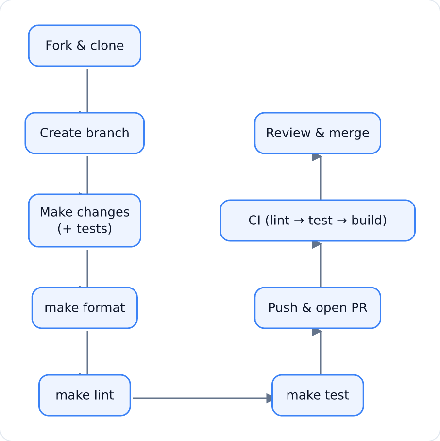

# Contributing

Thanks for helping improve the ALTA Shared Task 2026 baseline. Please read this
guide before opening a pull request.

## Table of contents

- [Code of Conduct](#code-of-conduct)
- [Ways to contribute](#ways-to-contribute)
- [Contribution workflow](#contribution-workflow)
- [Commit messages](#commit-messages)
- [Pull requests](#pull-requests)
- [Style guide](#style-guide)
- [Resources](#resources)

## Code of Conduct

All participants are expected to follow our
[Code of Conduct](../CODE_OF_CONDUCT.md).

## Ways to contribute

- Report bugs or dataset-schema issues.
- Improve the baseline (features, models, evaluation).
- Fix documentation, tooling or CI.
- Add support for new data formats.

## Contribution workflow

<p align="center">
  
</p>

1. **Fork** the repository and clone your fork.
2. Create a branch from `main`:

   ```bash
   git checkout -b feat/my-change
   ```

3. Install the dev environment (see [SETUP.md](SETUP.md)).
4. Make your changes, adding or updating tests as needed.

### Local development commands

```bash
make format     # auto-format and fix lint issues
make lint       # ruff + mypy
make test       # pytest
make check      # the full CI gate
```

Pre-commit hooks (ruff + mypy + hygiene checks) run automatically if you've run
`pre-commit install`.

## Commit messages

Use [Conventional Commits](https://www.conventionalcommits.org/):

```
<type>(<scope>): <summary>

<optional body>
<optional footer>
```

| Type | Purpose |
| --- | --- |
| `feat` | A new feature |
| `fix` | A bug fix |
| `docs` | Documentation changes |
| `test` | Adding or updating tests |
| `ci` | CI/CD configuration |
| `chore` | Tooling and maintenance |

Summaries should be imperative, lowercase and ≤ 72 characters.

Example:

```
feat(evaluate): add per-variety F1 breakdown

Closes #12
```

## Pull requests

- Keep PRs small and focused on one change.
- Reference related issues (`Fixes #123`).
- Update documentation where behaviour changes.
- Ensure `make check` passes before pushing.
- Fill in the pull request template.

## Style guide

- Python follows [PEP 8](https://peps.python.org/pep-0008/), enforced by
  **ruff** (line length 100) and **mypy**.
- Prefer type hints and docstrings on public functions.
- Keep the baseline simple and reproducible — the goal is a solid reference
  point, not unmaintainable cleverness.

## Resources

- [Conventional Commits](https://www.conventionalcommits.org/)
- [PEP 8 — Style Guide for Python Code](https://peps.python.org/pep-0008/)
- [Google Python Style Guide](https://google.github.io/styleguide/pyguide.html)
- [GitHub flow](https://docs.github.com/en/get-started/using-github/github-flow)

## Questions?

- Open an [issue](https://github.com/rifat-binreza/skills-introduction-to-git/issues).
- Task-specific questions: <shared.task@alta.asn.au>.
