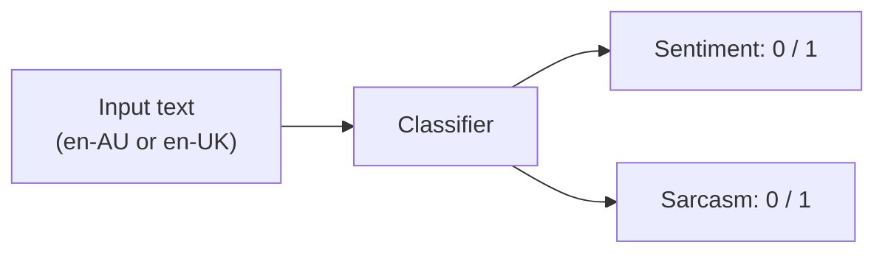
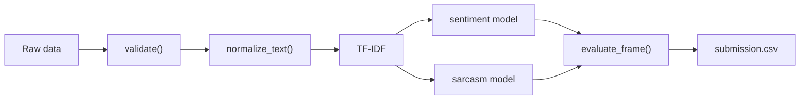

# ALTA Shared Task 2026 — Task Guide

This document summarises the 2026 ALTA Shared Task and how this repository
supports it.

## Table of contents

- [What is the ALTA Shared Task?](#what-is-the-alta-shared-task)
- [The 2026 task](#the-2026-task)
- [The BESSTIE benchmark](#the-besstie-benchmark)
- [Key dates](#key-dates)
- [Data format](#data-format)
- [Getting the data](#getting-the-data)
- [System pipeline](#system-pipeline)
- [Evaluation](#evaluation)
- [Submitting results](#submitting-results)
- [Resources](#resources)
- [Citation](#citation)

## What is the ALTA Shared Task?

The Australasian Language Technology Association (ALTA) runs an annual
programming competition in which all participants solve the same problem — a
"shared task". The 2026 edition is the seventeenth in the series, is open to
everyone (no team-size limits, no student/open split), and carries a **$500 AUD**
prize.

- **Website**: <https://www.alta.asn.au/events/sharedtask2026/>
- **Contact**: <shared.task@alta.asn.au>
- **Coordinator**: Diego Mollá-Aliod (Macquarie University)
- **Data**: Aditya Joshi & Dipankar Srirag (UNSW)

## The 2026 task

> Classify the **sentiment** and the **sarcasm** of Australian and British
> English text, using the en-AU and en-UK subsets of
> [BESSTIE](https://huggingface.co/datasets/unswnlporg/BESSTIE). Systems are
> expected to remain robust across both English varieties.

Both sub-tasks are binary classification problems:

| Task | Label `0` | Label `1` |
| --- | --- | --- |
| Sentiment | negative | positive |
| Sarcasm | not sarcastic | sarcastic |



## The BESSTIE benchmark

BESSTIE (Srirag et al., Findings of ACL 2025) is a manually annotated benchmark
for sentiment and sarcasm classification across three varieties of English —
Australian (en-AU), Indian (en-IN) and British (en-UK). Data comes from two
domains:

- **GOOGLE** — Google Places reviews, collected via location-based filtering.
- **REDDIT** — Reddit comments, collected via topic-based filtering.

The 2026 shared task uses the **en-AU** and **en-UK** subsets.

### Dataset at a glance

| Variety | Rows (public snapshot) | Domains |
| --- | --- | --- |
| en-AU | 3.08k | GOOGLE, REDDIT |
| en-IN | 3.79k | GOOGLE, REDDIT |
| en-UK | 3.21k | GOOGLE, REDDIT |

The public [Hugging Face snapshot](https://huggingface.co/datasets/unswnlporg/BESSTIE)
provides one config per variety (`en_AU`, `en_IN`, `en_UK`), each split into
`train` and `validation`. The official 2026 train/dev/test splits are released
to registered teams.

### Example annotations

| Variety | Text | Sentiment | Sarcasm |
| --- | --- | --- | --- |
| en-AU | "This was one of the best dishes I've EVER had! … perfectly cooked." | 1 | 0 |
| en-AU | "Ordered the 'avocado goodness' burger and this is how much avo was on it…" | 0 | 1 |
| en-AU | "Staff don't seem to care anymore. The manager… doesn't have service skills at all." | 0 | 0 |
| en-UK | "Traditional friendly pub. Excellent beer" | 1 | 0 |
| en-UK | "What a brave potatriot" | 0 | 1 |

## Key dates

| Milestone | Date |
| --- | --- |
| Registration & training/dev data release | Open (28 July 2026) |
| Test data release | 22 September 2026 |
| Deadline for submission of runs | 28 September 2026 |
| Notification of results | 1 October 2026 |
| System description due | 26 October 2026 |
| Camera-ready due | 2 November 2026 |
| Presentation at ALTA 2026 | 30 Nov – 2 Dec 2026 (Melbourne) |

## Data format

The tabular schema used by this repository:

| Column | Type | Description |
| --- | --- | --- |
| `text` | string | The review/comment to classify. |
| `sentiment` | int (0/1) | Binary sentiment label. |
| `sarcasm` | int (0/1) | Binary sarcasm label. |
| `variety` | string | `en-AU` or `en-UK` (optional). |
| `source` | string | `GOOGLE` or `REDDIT` (optional). |

The public Hugging Face snapshot is already in this wide format (columns
`source`, `variety`, `text`, `sentiment`, `sarcasm`). If you encounter a
*stacked* export (one row per `(text, task)` with a single `label` column), use
`alta_shared_task_2026.data.from_besstie_long()` to convert it. The final
submission format will be confirmed by the organisers when the test data is
released.

## Getting the data

1. Register by emailing <shared.task@alta.asn.au> with your team name and
   member details.
2. Download the official training/development data from the task website.
3. Place files under `data/raw/` and point the CLI at them.

Optionally, load the public snapshot directly (requires the `hf` extra):

```bash
pip install 'alta-shared-task-2026[hf]'
python -c "from alta_shared_task_2026.data import load_huggingface as l; l(config='en_AU').to_csv('data/raw/besstie-en-AU.csv', index=False)"
```

> Note: the Hub snapshot is distributed under **CC-BY-NC-4.0** — check the
> license before any redistribution.

## System pipeline



## Evaluation

The organisers score submitted runs on the shared test set. This repository
reports per-task **accuracy**, **precision**, **recall** and **macro-F1** —
both overall and per variety — so you can check robustness across en-AU and
en-UK while developing:

```bash
alta2026 evaluate --model-dir models --data data/processed/dev.csv --by-variety
```

| Metric | Why it matters for this task |
| --- | --- |
| **Accuracy** | Intuitive overall score; fine for balanced splits. |
| **Macro-F1** | Robust to class imbalance; standard for shared tasks. |
| **Per-variety F1** | Flags over-fitting to one variety (the task's core requirement). |

## Submitting results

1. Train baselines (or your own models) and produce predictions:

   ```bash
   alta2026 train --train data/processed/train.csv --model-dir models
   alta2026 predict --model-dir models --test data/raw/test.csv --output submission.csv
   ```

2. Verify the submission file contains `id`, `sentiment` and `sarcasm` columns.
3. Email your runs to the organisers before the submission deadline, and
   prepare a system description for the workshop proceedings.

## Resources

- [ALTA website](https://www.alta.asn.au/) · [2026 Shared Task](https://www.alta.asn.au/events/sharedtask2026/) · [ALTA 2026 Workshop](https://alta2026.alta.asn.au/)
- [BESSTIE on the Hugging Face Hub](https://huggingface.co/datasets/unswnlporg/BESSTIE)
- [BESSTIE paper (ACL Anthology)](https://aclanthology.org/2025.findings-acl.441/) · [arXiv](https://arxiv.org/abs/2412.04726)
- [UNSW NLP BESSTIE GitHub repository](https://github.com/unswnlp/BESSTIE)

## Citation

```bibtex
@inproceedings{srirag-etal-2025-besstie,
    title = "{BESSTIE}: A Benchmark for Sentiment and Sarcasm Classification for Varieties of {E}nglish",
    author = "Srirag, Dipankar and Joshi, Aditya and Painter, Jordan and Kanojia, Diptesh",
    booktitle = "Findings of the Association for Computational Linguistics: ACL 2025",
    month = jul,
    year = "2025",
    address = "Vienna, Austria",
    publisher = "Association for Computational Linguistics",
    doi = "10.18653/v1/2025.findings-acl.441",
    pages = "8413--8429",
}
```
